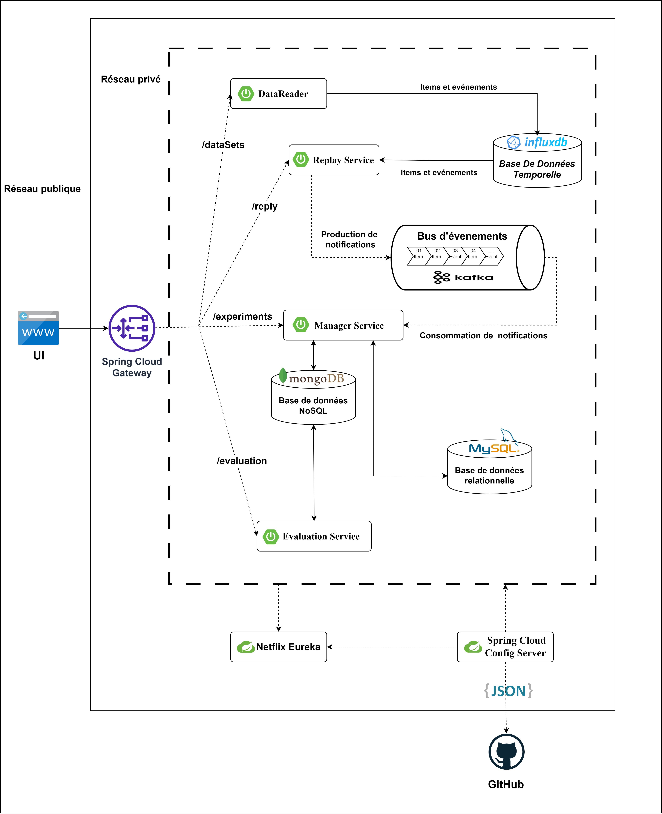

# 🚀 Recommender-EaaS – Distributed Offline Evaluation Platform

A distributed **Evaluation-as-a-Service (EaaS)** platform designed to benchmark recommendation algorithms using a microservices architecture.  
The system supports **offline evaluation**, dynamic data streaming, and scalable microservices communication powered by **Apache Kafka**.

---

## 📌 Table of Contents
- [Overview](#-overview)
- [Project Realm – System Overview](#-project-realm--system-overview)
- [Features](#-features)
- [Architecture](#-architecture)
- [Tech Stack](#-tech-stack)
- [Microservices](#-microservices)
- [Datasets](#-datasets)
- [Evaluation Metrics](#-evaluation-metrics)
- [Installation](#-installation)
- [Project Structure](#-project-structure)
- [Screenshots](#-screenshots)
- [Author](#-author)

---

## 🧠 Overview

The platform provides a full workflow to:
- Load datasets (user–item interactions)
- Trigger evaluation scenarios
- Execute multiple recommendation algorithms
- Stream notifications, events, and interactions using Kafka
- Generate evaluation metrics (Precision, Recall, MAP, NDCG...)
- Visualize results in a modern web UI built with **React.js**

This architecture is designed to be scalable, modular, and efficient for research and production.

---

# 🧭 Project Realm – System Overview  
*(Explanation Based on the Architecture Diagram)*

This project implements a **distributed microservices platform** designed for the **offline evaluation of recommendation algorithms**.  
It relies on **Spring Boot**, **Apache Kafka**, and a modern **React** interface.  
The architecture diagram illustrates how each component collaborates to form a fully distributed, scalable, and event-driven environment.

---

## 🌐 1. Public Entry Point – UI & API Gateway

The user interacts through a **React.js UI**, which communicates only with the **Spring Cloud Gateway**.  
The Gateway routes requests securely to the backend microservices.

Main routes:
- `/datasets` → DataReader  
- `/reply` → Replay Service  
- `/experiments` → Manager Service  
- `/evaluation` → Evaluation Service  

---

## 📥 2. DataReader Service – Dataset Loader

- Loads dataset files (CSV, JSON, DB)  
- Extracts items & interactions  
- Sends structured data to Replay Service  
- Prepares the system for offline evaluation  

---

## 🔄 3. Replay Service – Event Stream Generator

This service transforms static datasets into dynamic event streams:

- Produces **items & events** to Kafka topics  
- Sends notifications to Manager Service  
- Pushes temporal data to **InfluxDB** (time-series storage)  
- Simulates real user behaviors offline  

---

## 🧵 4. Kafka Event Bus – Core of the Architecture

Kafka ensures:
- High-throughput event streaming  
- Asynchronous microservice communication  
- Reliability and fault tolerance  
- Topic-based separation: `items`, `events`, `notifications`, `results`  

Kafka is the heart of the distributed system.

---

## 🎛 5. Manager Service – Experiment Orchestration Layer

- Receives evaluation requests from the UI  
- Coordinates replay sessions  
- Listens to notifications from Kafka  
- Stores metadata in **MongoDB**  
- Controls experiment lifecycle  
- Handles multi-dataset and multi-algorithm scenarios  

---

## 🧠 6. Evaluation Service – Algorithm Engine

Responsible for executing algorithms and generating metrics:

- Reads data from MongoDB & MySQL  
- Runs algorithms (MostPopular, RecentlyPopular, Random, etc.)  
- Computes metrics: Precision@K, Recall@K, MAP, MRR, NDCG  
- Publishes results via REST or Kafka  

---

## 🗃 7. Databases – Polyglot Persistence

### **MongoDB**
- Stores experiment metadata  
- Stores events & interactions  
- NoSQL flexibility  

### **MySQL**
- Stores structured relational data  
- Items, users, analytics  

### **InfluxDB**
- Time-series handling  
- Stores temporal event sequences  

Each DB plays a unique role.

---

## 🛰 8. Service Discovery & Configuration

### **Netflix Eureka**
- Manages service registration  
- Enables dynamic discovery  
- Prevents hardcoded URLs  

### **Spring Cloud Config Server**
- Loads configurations from **GitHub**  
- Ensures version control of application configs  
- Enables smooth environment transitions  

---

## 🎯 Final Summary

This platform provides:

- Offline evaluation for recommendation algorithms  
- Real-time streaming using Kafka  
- Distributed microservices orchestration  
- Hybrid data persistence  
- A scalable and extensible Evaluation-as-a-Service solution  

---

# 🔥 Features

### 🟦 Core Features
- Offline evaluation  
- Event-driven architecture  
- Real-time streaming  
- Multiple datasets supported  
- Microservices isolation  

### 🛠 Developer Features
- Clean, layered architecture  
- REST APIs  
- Kafka integration  
- MongoDB + MySQL hybrid design  
- Ready for CI/CD  

---

# 🧩 Architecture Diagram

---

# 🛠 Tech Stack

### Backend
- Spring Boot  
- Spring Cloud  
- Kafka  
- MongoDB  
- MySQL  
- InfluxDB  

### Frontend
- React.js  
- TailwindCSS  

### DevOps
- Docker  
- GitHub/GitLab CI  

---

# 🧱 Microservices

| Service | Description |
|--------|-------------|
| DataReader | Loads dataset files and prepares data |
| Replay Service | Produces items & events to Kafka |
| Manager Service | Orchestrates experiments |
| Evaluation Service | Runs algorithms and computes metrics |
| Config Server | Centralized configuration |
| Eureka Server | Service discovery |
| Gateway | Routing & security layer |

---

# 📁 Project Structure

Recommender-EaaS
│

        ├── backend/
        │ ├── manager-service/
        │ ├── replay-service/
        │ ├── dataReader-service/
        │ ├── Evaluation-service/
        │ ├── gateway/
        │ └── config-server/

            ├── frontend/
            │ ├── public/
            │ ├── src/
            │ │ ├── components/
            │ │ ├── pages/
            │ │ ├── utils/
            │ │ ├── hooks/
            │ │ └── services/
            │
            └── docker-compose.yml

yaml
Copier le code

---

# 🧪 Screenshots
*(Add UI or Figma images here later)*

---

# 👤 Author

**Yasser Boubessit**  
Full Stack Developer – Master in Artificial Intelligence  
📍 Algeria  
📧 yasserboubessit@gmail.com  
🔗 GitHub: github.com/yasser732boubessit  

---

# ⭐ Contribution

Contributions are welcome. Please open an issue or PR.

---

# 📜 License

MIT License © 2025 – Yasser Boubessit
